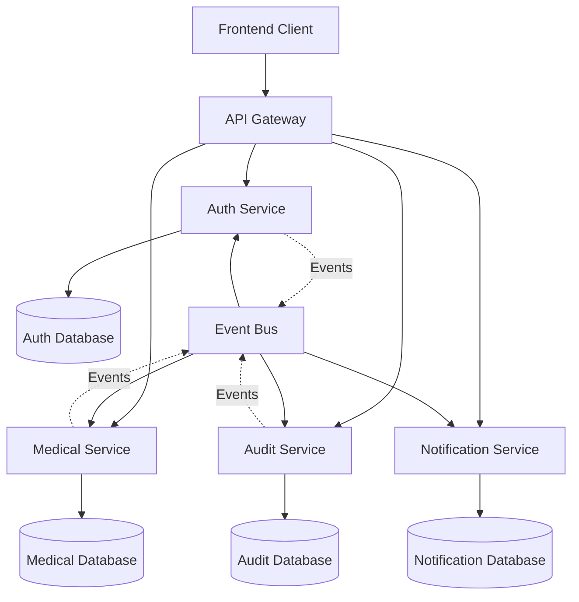

# 🏗️ Microservices Architecture Documentation

## 📋 Architecture Overview

The Secure Health Record System is designed as a microservices architecture to ensure scalability, maintainability, and team productivity. This document outlines the complete architectural decisions and implementation strategy.

## 🎯 Architecture Principles

### Design Goals
- **Scalability**: Independent scaling of services
- **Maintainability**: Clear service boundaries and responsibilities
- **Security**: Zero-trust security model with service-to-service authentication
- **Resilience**: Fault isolation and graceful degradation
- **Development Velocity**: Parallel development by 3 backend developers

### Service Philosophy
- **Single Responsibility**: Each service owns one business domain
- **Database per Service**: No shared databases between services
- **API-First**: Contract-driven development
- **Event-Driven**: Asynchronous communication where appropriate

## 🏗️ Service Architecture



## 🔐 Auth Service (Developer 1)

### Responsibilities
- User authentication and authorization
- JWT token management
- Role and permission management
- MFA implementation
- Password policies and reset functionality

### API Endpoints
```
POST   /api/auth/register
POST   /api/auth/login
POST   /api/auth/logout
POST   /api/auth/refresh
POST   /api/auth/change-password
POST   /api/auth/reset-password
GET    /api/auth/validate-token
GET    /api/auth/user/{id}
PUT    /api/auth/user/{id}
POST   /api/auth/assign-role
DELETE /api/auth/remove-role
```

### Database Schema
```sql
-- Users table
CREATE TABLE Users (
    Id NVARCHAR(450) PRIMARY KEY,
    UserName NVARCHAR(256),
    Email NVARCHAR(256),
    PasswordHash NVARCHAR(MAX),
    FirstName NVARCHAR(100),
    LastName NVARCHAR(100),
    IDNP NVARCHAR(13),
    PhoneNumber NVARCHAR(20),
    DateOfBirth DATETIME2,
    Gender INT,
    Address NVARCHAR(500),
    IsActive BIT,
    CreatedAt DATETIME2,
    UpdatedAt DATETIME2
);

-- Roles table
CREATE TABLE Roles (
    Id NVARCHAR(450) PRIMARY KEY,
    Name NVARCHAR(256),
    Description NVARCHAR(500),
    CreatedAt DATETIME2
);

-- UserRoles table
CREATE TABLE UserRoles (
    UserId NVARCHAR(450),
    RoleId NVARCHAR(450),
    AssignedAt DATETIME2,
    AssignedBy NVARCHAR(450),
    PRIMARY KEY (UserId, RoleId)
);
```

### Configuration
```json
{
  "JwtSettings": {
    "SecretKey": "${JWT_SECRET_KEY}",
    "Issuer": "SecureHealthRecord",
    "Audience": "HealthRecordUsers",
    "ExpirationMinutes": 60,
    "RefreshTokenExpirationDays": 7
  },
  "PasswordPolicy": {
    "RequiredLength": 8,
    "RequireDigit": true,
    "RequireLowercase": true,
    "RequireUppercase": true,
    "RequireNonAlphanumeric": true,
    "MaxFailedLoginAttempts": 5,
    "LockoutDurationMinutes": 30
  }
}
```

## 🏥 Medical Service (Developer 2)

### Responsibilities
- Patient profile management
- Medical record creation and retrieval
- Appointment scheduling
- Vaccination record management
- Allergy and medical alert management
- Document upload and storage

### API Endpoints
```
# Patient Management
GET    /api/patients
GET    /api/patients/{id}
POST   /api/patients
PUT    /api/patients/{id}
GET    /api/patients/search?idnp={idnp}

# Medical Records
GET    /api/patients/{patientId}/visits
POST   /api/patients/{patientId}/visits
GET    /api/patients/{patientId}/visits/{visitId}
PUT    /api/patients/{patientId}/visits/{visitId}

# Vaccinations
GET    /api/patients/{patientId}/vaccinations
POST   /api/patients/{patientId}/vaccinations
PUT    /api/patients/{patientId}/vaccinations/{vaccinationId}

# Allergies
GET    /api/patients/{patientId}/allergies
POST   /api/patients/{patientId}/allergies
PUT    /api/patients/{patientId}/allergies/{allergyId}

# Documents
POST   /api/patients/{patientId}/documents
GET    /api/patients/{patientId}/documents
GET    /api/documents/{documentId}/download
```

### Database Schema
```sql
-- Patients table
CREATE TABLE Patients (
    Id NVARCHAR(450) PRIMARY KEY,
    UserId NVARCHAR(450) UNIQUE, -- Reference to Auth Service
    IDNP NVARCHAR(13) UNIQUE,
    BloodType NVARCHAR(10),
    Height DECIMAL(5,2),
    Weight DECIMAL(5,2),
    EmergencyContactName NVARCHAR(200),
    EmergencyContactPhone NVARCHAR(20),
    ChronicConditions NVARCHAR(MAX), -- JSON array
    CreatedAt DATETIME2,
    UpdatedAt DATETIME2
);

-- Visits table
CREATE TABLE Visits (
    Id NVARCHAR(450) PRIMARY KEY,
    PatientId NVARCHAR(450),
    DoctorId NVARCHAR(450), -- Reference to Auth Service
    VisitDate DATETIME2,
    ChiefComplaint NVARCHAR(500),
    Symptoms NVARCHAR(MAX), -- JSON array
    VitalSigns NVARCHAR(MAX), -- JSON object
    Diagnosis NVARCHAR(MAX), -- JSON object with ICD-10
    Treatment NVARCHAR(MAX),
    Medications NVARCHAR(MAX), -- JSON array
    FollowUpInstructions NVARCHAR(MAX),
    CreatedAt DATETIME2,
    UpdatedAt DATETIME2
);

-- Vaccinations table
CREATE TABLE Vaccinations (
    Id NVARCHAR(450) PRIMARY KEY,
    PatientId NVARCHAR(450),
    VaccineType NVARCHAR(200),
    Manufacturer NVARCHAR(200),
    BatchNumber NVARCHAR(100),
    AdministrationDate DATETIME2,
    AdministeredBy NVARCHAR(450), -- Doctor/Nurse ID
    Site NVARCHAR(100),
    AdverseReactions NVARCHAR(500),
    NextDueDate DATETIME2,
    CreatedAt DATETIME2
);

-- Allergies table
CREATE TABLE Allergies (
    Id NVARCHAR(450) PRIMARY KEY,
    PatientId NVARCHAR(450),
    Allergen NVARCHAR(200),
    AllergyType NVARCHAR(100), -- Drug, Food, Environmental
    Severity NVARCHAR(50), -- Mild, Moderate, Severe
    Reaction NVARCHAR(500),
    OnsetDate DATETIME2,
    Status NVARCHAR(50), -- Active, Resolved, Suspected
    Notes NVARCHAR(1000),
    CreatedAt DATETIME2,
    UpdatedAt DATETIME2
);
```

### Service Communication
```csharp
public interface IAuthServiceClient
{
    Task<UserDto> GetUserAsync(string userId);
    Task<bool> ValidateTokenAsync(string token);
    Task<bool> HasPermissionAsync(string userId, string permission);
}

public interface IAuditServiceClient
{
    Task LogAccessAsync(AuditLogEntry entry);
    Task LogDataChangeAsync(DataChangeEntry entry);
}
```

## 📊 Audit Service (Developer 3)

### Responsibilities
- Comprehensive audit logging
- GDPR compliance tracking
- Access pattern analysis
- Security event monitoring
- Data retention management

### API Endpoints
```
POST   /api/audit/log
GET    /api/audit/logs
GET    /api/audit/logs/patient/{patientId}
GET    /api/audit/logs/user/{userId}
GET    /api/audit/security-events
GET    /api/audit/reports
POST   /api/audit/reports/generate
```

### Database Schema
```sql
-- AuditLogs table
CREATE TABLE AuditLogs (
    Id NVARCHAR(450) PRIMARY KEY,
    Timestamp DATETIME2,
    UserId NVARCHAR(450),
    UserType NVARCHAR(50), -- Doctor, Patient, Admin
    Action NVARCHAR(100),
    ResourceType NVARCHAR(100), -- Patient, Visit, Document
    ResourceId NVARCHAR(450),
    PatientId NVARCHAR(450), -- For patient-related actions
    IPAddress NVARCHAR(45),
    UserAgent NVARCHAR(500),
    Location NVARCHAR(200), -- Clinic/Hospital
    Success BIT,
    ErrorMessage NVARCHAR(MAX),
    AdditionalData NVARCHAR(MAX), -- JSON
    Severity NVARCHAR(20), -- INFO, WARNING, ERROR, CRITICAL
    CreatedAt DATETIME2
);

-- SecurityEvents table
CREATE TABLE SecurityEvents (
    Id NVARCHAR(450) PRIMARY KEY,
    EventType NVARCHAR(100),
    Severity NVARCHAR(20),
    Description NVARCHAR(1000),
    UserId NVARCHAR(450),
    IPAddress NVARCHAR(45),
    EventData NVARCHAR(MAX), -- JSON
    Resolved BIT,
    ResolvedBy NVARCHAR(450),
    ResolvedAt DATETIME2,
    CreatedAt DATETIME2
);
```

### Event Processing
```csharp
public class AuditEventProcessor
{
    public async Task ProcessUserLoginEvent(UserLoginEvent evt)
    {
        var auditEntry = new AuditLogEntry
        {
            UserId = evt.UserId,
            Action = "USER_LOGIN",
            Timestamp = evt.Timestamp,
            IPAddress = evt.IPAddress,
            Success = evt.Success
        };
        
        await _auditRepository.LogAsync(auditEntry);
        
        // Check for suspicious patterns
        await _securityAnalyzer.AnalyzeLoginPattern(evt);
    }
    
    public async Task ProcessPatientAccessEvent(PatientAccessEvent evt)
    {
        var auditEntry = new AuditLogEntry
        {
            UserId = evt.DoctorId,
            Action = "PATIENT_RECORD_ACCESS",
            PatientId = evt.PatientId,
            ResourceType = "Patient",
            ResourceId = evt.PatientId,
            Timestamp = evt.Timestamp
        };
        
        await _auditRepository.LogAsync(auditEntry);
        
        // Notify patient of access
        await _notificationService.NotifyPatientOfAccess(evt.PatientId, evt.DoctorId);
    }
}
```

## 📧 Notification Service (Developer 3)

### Responsibilities
- Email notifications
- SMS alerts
- Real-time push notifications
- Notification preferences management
- Emergency communication protocols

### API Endpoints
```
POST   /api/notifications/email
POST   /api/notifications/sms
POST   /api/notifications/push
GET    /api/notifications/preferences/{userId}
PUT    /api/notifications/preferences/{userId}
GET    /api/notifications/history/{userId}
```

### Database Schema
```sql
-- NotificationPreferences table
CREATE TABLE NotificationPreferences (
    UserId NVARCHAR(450) PRIMARY KEY,
    EmailNotifications BIT,
    SMSNotifications BIT,
    PushNotifications BIT,
    SecurityAlerts BIT,
    VisitReminders BIT,
    RecordAccess BIT,
    VaccinationReminders BIT,
    Preferences NVARCHAR(MAX), -- JSON
    UpdatedAt DATETIME2
);

-- NotificationHistory table
CREATE TABLE NotificationHistory (
    Id NVARCHAR(450) PRIMARY KEY,
    UserId NVARCHAR(450),
    Type NVARCHAR(50), -- EMAIL, SMS, PUSH
    Subject NVARCHAR(200),
    Content NVARCHAR(MAX),
    Status NVARCHAR(50), -- SENT, FAILED, PENDING
    SentAt DATETIME2,
    DeliveredAt DATETIME2,
    ErrorMessage NVARCHAR(500),
    CreatedAt DATETIME2
);
```

## 🌐 API Gateway

### Responsibilities
- Request routing and load balancing
- Authentication and authorization
- Rate limiting and throttling
- Request/response transformation
- API versioning

### Gateway Configuration
```json
{
  "Routes": [
    {
      "DownstreamPathTemplate": "/api/auth/{everything}",
      "DownstreamScheme": "https",
      "DownstreamHostAndPorts": [
        {
          "Host": "auth-service",
          "Port": 80
        }
      ],
      "UpstreamPathTemplate": "/api/auth/{everything}",
      "UpstreamHttpMethod": ["GET", "POST", "PUT", "DELETE"]
    },
    {
      "DownstreamPathTemplate": "/api/patients/{everything}",
      "DownstreamScheme": "https",
      "DownstreamHostAndPorts": [
        {
          "Host": "medical-service",
          "Port": 80
        }
      ],
      "UpstreamPathTemplate": "/api/patients/{everything}",
      "UpstreamHttpMethod": ["GET", "POST", "PUT", "DELETE"],
      "AuthenticationOptions": {
        "AuthenticationProviderKey": "Bearer"
      }
    }
  ],
  "GlobalConfiguration": {
    "BaseUrl": "https://api.healthrecord.md",
    "RateLimitOptions": {
      "EnableRateLimiting": true,
      "Period": "1m",
      "PeriodTimespan": 60,
      "Limit": 100
    }
  }
}
```

## 📡 Event Bus Architecture

### Event-Driven Communication
```csharp
public interface IEventBus
{
    Task PublishAsync<T>(T @event) where T : IntegrationEvent;
    Task SubscribeAsync<T, THandler>() 
        where T : IntegrationEvent 
        where THandler : IIntegrationEventHandler<T>;
}

public abstract class IntegrationEvent
{
    public Guid Id { get; } = Guid.NewGuid();
    public DateTime CreatedAt { get; } = DateTime.UtcNow;
    public string Source { get; set; }
}

// Example events
public class UserRegisteredEvent : IntegrationEvent
{
    public string UserId { get; set; }
    public string Email { get; set; }
    public string UserType { get; set; }
}

public class PatientAccessedEvent : IntegrationEvent
{
    public string PatientId { get; set; }
    public string DoctorId { get; set; }
    public string AccessType { get; set; }
    public DateTime AccessTime { get; set; }
}
```

## 🔒 Security Architecture

### Service-to-Service Authentication
```csharp
public class ServiceTokenMiddleware
{
    public async Task InvokeAsync(HttpContext context, RequestDelegate next)
    {
        var serviceToken = context.Request.Headers["X-Service-Token"];
        
        if (!string.IsNullOrEmpty(serviceToken))
        {
            var isValid = await _serviceTokenValidator.ValidateAsync(serviceToken);
            if (isValid)
            {
                context.Items["ServiceAuthenticated"] = true;
            }
        }
        
        await next(context);
    }
}
```

### Zero Trust Security Model
- All service communication requires authentication
- JWT tokens for user authentication
- Service tokens for inter-service communication
- TLS encryption for all communications
- Network segmentation and firewalls

## 📊 Monitoring & Observability

### Logging Strategy
```csharp
public class CorrelationIdMiddleware
{
    public async Task InvokeAsync(HttpContext context, RequestDelegate next)
    {
        var correlationId = context.Request.Headers["X-Correlation-ID"].FirstOrDefault() 
                           ?? Guid.NewGuid().ToString();
        
        context.Items["CorrelationId"] = correlationId;
        context.Response.Headers.Add("X-Correlation-ID", correlationId);
        
        using (LogContext.PushProperty("CorrelationId", correlationId))
        {
            await next(context);
        }
    }
}
```

### Health Checks
```csharp
public void ConfigureServices(IServiceCollection services)
{
    services.AddHealthChecks()
        .AddDbContext<ApplicationDbContext>()
        .AddUrlGroup(new Uri("https://auth-service/health"), "auth-service")
        .AddUrlGroup(new Uri("https://medical-service/health"), "medical-service")
        .AddUrlGroup(new Uri("https://audit-service/health"), "audit-service");
}
```

## 🐳 Deployment Architecture

### Docker Containerization
```dockerfile
# Example Dockerfile for Auth Service
FROM mcr.microsoft.com/dotnet/aspnet:9.0 AS base
WORKDIR /app
EXPOSE 80
EXPOSE 443

FROM mcr.microsoft.com/dotnet/sdk:9.0 AS build
WORKDIR /src
COPY ["AuthService/AuthService.csproj", "AuthService/"]
RUN dotnet restore "AuthService/AuthService.csproj"
COPY . .
WORKDIR "/src/AuthService"
RUN dotnet build "AuthService.csproj" -c Release -o /app/build

FROM build AS publish
RUN dotnet publish "AuthService.csproj" -c Release -o /app/publish

FROM base AS final
WORKDIR /app
COPY --from=publish /app/publish .
ENTRYPOINT ["dotnet", "AuthService.dll"]
```

### Docker Compose Configuration
```yaml
version: '3.8'

services:
  auth-service:
    build:
      context: .
      dockerfile: AuthService/Dockerfile
    ports:
      - "5001:80"
    environment:
      - ConnectionStrings__DefaultConnection=Server=auth-db;Database=AuthDB;User=sa;Password=YourPassword123!
    depends_on:
      - auth-db

  medical-service:
    build:
      context: .
      dockerfile: MedicalService/Dockerfile
    ports:
      - "5002:80"
    environment:
      - ConnectionStrings__DefaultConnection=Server=medical-db;Database=MedicalDB;User=sa;Password=YourPassword123!
    depends_on:
      - medical-db

  audit-service:
    build:
      context: .
      dockerfile: AuditService/Dockerfile
    ports:
      - "5003:80"
    environment:
      - ConnectionStrings__DefaultConnection=Server=audit-db;Database=AuditDB;User=sa;Password=YourPassword123!
    depends_on:
      - audit-db

  api-gateway:
    build:
      context: .
      dockerfile: ApiGateway/Dockerfile
    ports:
      - "5000:80"
    environment:
      - Ocelot__BaseUrl=https://localhost:5000
    depends_on:
      - auth-service
      - medical-service
      - audit-service

  auth-db:
    image: mcr.microsoft.com/mssql/server:2022-latest
    environment:
      - ACCEPT_EULA=Y
      - SA_PASSWORD=YourPassword123!
    ports:
      - "1433:1433"

  medical-db:
    image: mcr.microsoft.com/mssql/server:2022-latest
    environment:
      - ACCEPT_EULA=Y
      - SA_PASSWORD=YourPassword123!
    ports:
      - "1434:1433"

  audit-db:
    image: mcr.microsoft.com/mssql/server:2022-latest
    environment:
      - ACCEPT_EULA=Y
      - SA_PASSWORD=YourPassword123!
    ports:
      - "1435:1433"
```

## 📈 Scalability Considerations

### Horizontal Scaling
- Each service can be scaled independently
- Load balancers distribute traffic across service instances
- Database read replicas for read-heavy operations
- Caching layers (Redis) for frequently accessed data

### Performance Optimization
- Database indexing strategy
- Connection pooling
- Asynchronous processing
- Caching at multiple levels
- CDN for static content

---

*This architecture documentation provides the foundation for building a scalable, secure, and maintainable healthcare record system using microservices patterns and best practices.*
