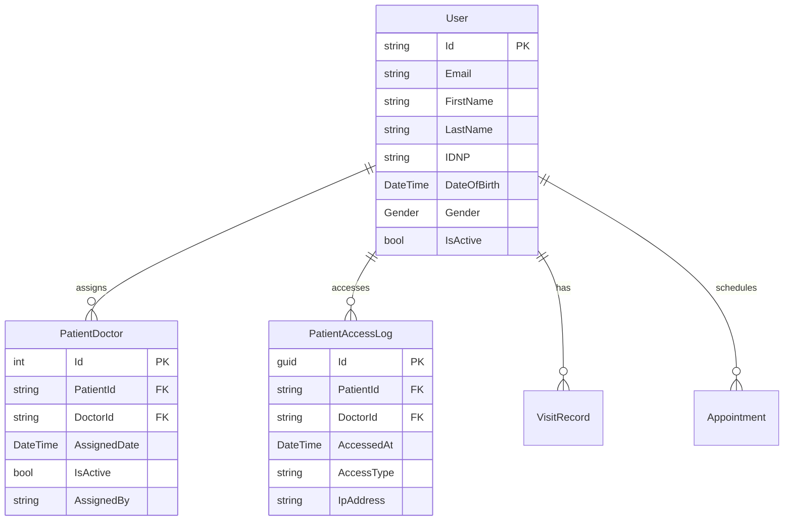

# Tehnici și Modelarea Proiectarea Software
## Medical Management API System

### Prezentare Proiect - Andrei Blîndu
**Data:** Octombrie 2025  
**Disciplina:** Tehnici și Modelarea Proiectarea Software

---

## 1. PREZENTAREA GENERALĂ A PROIECTULUI

### 1.1 Scopul și Obiectivele
- **Sistem de management medical** complet pentru gestionarea pacienților, doctorilor și datelor medicale
- **API RESTful** pentru integrare cu aplicații frontend și mobile
- **Sistem de audit și transparență** pentru accesul la datele pacienților
- **Managementul relațiilor pacient-doctor** cu control granular al accesului

### 1.2 Tehnologii Utilizate
- **Framework:** ASP.NET Core 9.0
- **Baza de Date:** SQL Server cu Entity Framework Core
- **Autentificare:** ASP.NET Identity cu JWT tokens
- **Mapping:** AutoMapper
- **Logging:** Serilog
- **Documentație API:** Swagger/OpenAPI

---

## 2. TEHNICI DE PROIECTARE SOFTWARE APLICATE

### 2.1 Arhitectura Layered (N-Tier Architecture)

```
┌─────────────────────┐
│   Presentation      │ ← Controllers (API Endpoints)
├─────────────────────┤
│   Business Logic    │ ← Services, Validators
├─────────────────────┤
│   Data Access       │ ← Repositories, DbContext
├─────────────────────┤
│   Database          │ ← SQL Server
└─────────────────────┘
```

**Avantaje implementate:**
- Separarea responsabilităților
- Testabilitate îmbunătățită
- Maintainability și scalabilitate

### 2.2 Design Patterns Implementate

#### A. Repository Pattern
```csharp
// Exemplu: ApplicationDbContext ca Repository
public class ApplicationDbContext : IdentityDbContext<User>
{
    public DbSet<Patient> Patients { get; set; }
    public DbSet<Doctor> Doctors { get; set; }
    public DbSet<PatientAccessLog> PatientAccessLogs { get; set; }
}
```

#### B. Dependency Injection Pattern
```csharp
// Program.cs - Configurarea DI Container
builder.Services.AddScoped<IAuthService, AuthService>();
builder.Services.AddScoped<IPatientAccessLogService, PatientAccessLogService>();
builder.Services.AddScoped<IAuditService, AuditService>();
```

#### C. Factory Pattern (Auto Mapper)
```csharp
public class MappingProfile : Profile
{
    public MappingProfile()
    {
        CreateMap<User, PatientDto>();
        CreateMap<PatientAccessLog, PatientAccessLogDto>();
    }
}
```

#### D. Strategy Pattern (Role-based Authorization)
```csharp
[Authorize(Roles = "Patient,Doctor,Admin")]
public async Task<IActionResult> GetPatientData()
{
    // Strategii diferite în funcție de rol
    if (User.IsInRole("Admin"))
        return await GetAllPatientData();
    else if (User.IsInRole("Doctor"))
        return await GetAssignedPatientData();
    else
        return await GetOwnPatientData();
}
```

### 2.3 SOLID Principles

#### Single Responsibility Principle (SRP)
```csharp
// Fiecare service are o singură responsabilitate
public class PatientAccessLogService // Doar pentru logging acces pacienti
public class AuthService // Doar pentru autentificare
public class AuditService // Doar pentru audit trail
```

#### Open/Closed Principle (OCP)
```csharp
// Extensibil prin interfețe
public interface IPatientAccessLogService
{
    Task LogPatientAccessAsync(...);
    // Pot fi adăugate noi metode fără modificarea implementării existente
}
```

#### Liskov Substitution Principle (LSP)
```csharp
// Toate implementările IAuthService pot fi substituibile
IAuthService authService = new AuthService(); // sau orice altă implementare
```

#### Interface Segregation Principle (ISP)
```csharp
// Interfețe specifice, nu monolitice
public interface IAuditService { /* doar audit */ }
public interface IAuthService { /* doar auth */ }
public interface IPatientAccessLogService { /* doar access logging */ }
```

#### Dependency Inversion Principle (DIP)
```csharp
// Controllers depind de abstracții, nu de implementări concrete
public class PatientController : BaseApiController
{
    private readonly IPatientAccessLogService _patientAccessLogService;
    // Nu depinde direct de PatientAccessLogService
}
```

---

## 3. MODELAREA DATELOR ȘI RELAȚIILOR

### 3.1 Entity Relationship Model



### 3.2 Domain Model Classes

#### Core Entities
```csharp
// User - Entitatea centrală
public class User : IdentityUser
{
    public string FirstName { get; set; }
    public string LastName { get; set; }
    public string IDNP { get; set; }
    public DateTime DateOfBirth { get; set; }
    public Gender Gender { get; set; }
    public bool IsActive { get; set; }
    
    // Navigation properties pentru relații
    public virtual ICollection<UserRole> UserRoles { get; set; }
}

// PatientDoctor - Relația many-to-many
public class PatientDoctor
{
    public int Id { get; set; }
    public string PatientId { get; set; }
    public string DoctorId { get; set; }
    public DateTime AssignedDate { get; set; }
    public bool IsActive { get; set; }
    public string AssignedBy { get; set; }
    
    // Navigation properties
    public virtual User Patient { get; set; }
    public virtual User Doctor { get; set; }
}
```

---

## 4. ARHITECTURA ȘI DESIGN PATTERNS AVANSATE

### 4.1 Command Query Responsibility Segregation (CQRS) Concepts

```csharp
// Separarea comenzilor de query-uri
public class PatientController
{
    // Commands (modifică starea)
    [HttpPost("add-doctor")]
    public async Task<IActionResult> AddDoctor([FromBody] AddDoctorDto dto)
    
    // Queries (citesc starea)  
    [HttpGet("my-doctors")]
    public async Task<IActionResult> GetMyDoctors()
}
```

### 4.2 Audit Trail Pattern
```csharp
public class PatientAccessLogService
{
    public async Task LogPatientAccessAsync(
        string doctorId, 
        string patientId, 
        string accessType,
        string ipAddress)
    {
        // Înregistrează automat toate accesările datelor
        var accessLog = new PatientAccessLog
        {
            DoctorId = doctorId,
            PatientId = patientId,
            AccessType = accessType,
            AccessedAt = DateTime.UtcNow,
            IpAddress = ipAddress
        };
        
        await _context.SaveChangesAsync();
    }
}
```

### 4.3 Generic Repository Pattern
```csharp
public class ApplicationDbContext : IdentityDbContext<User>
{
    // Generic DbSet pentru toate entitățile
    public DbSet<TEntity> Set<TEntity>() where TEntity : class
    
    // Configurare prin Fluent API
    protected override void OnModelCreating(ModelBuilder builder)
    {
        builder.Entity<PatientDoctor>(entity =>
        {
            entity.HasKey(pd => pd.Id);
            entity.HasOne(pd => pd.Patient)
                  .WithMany()
                  .HasForeignKey(pd => pd.PatientId);
        });
    }
}
```

---

## 5. TEHNICI DE VALIDARE ȘI ERROR HANDLING

### 5.1 Data Validation
```csharp
public class RegisterDto
{
    [Required]
    [EmailAddress]
    public string Email { get; set; }

    [Required]
    [MinLength(6)]
    public string Password { get; set; }

    [Required]
    [MaxLength(13)]
    public string IDNP { get; set; }

    [Required]
    public UserRegistrationType UserRole { get; set; }
}
```

### 5.2 Centralized Error Handling
```csharp
public class BaseApiController : ControllerBase
{
    protected IActionResult SuccessResponse<T>(T data, string message = "Success")
    {
        return Ok(new ApiResponse<T>
        {
            Success = true,
            Message = message,
            Data = data
        });
    }
    
    protected IActionResult ErrorResponse(string message, object errors = null)
    {
        return BadRequest(new ApiResponse<object>
        {
            Success = false,
            Message = message,
            Errors = errors
        });
    }
}
```

---

## 6. SECURITATEA ȘI CONTROLUL ACCESULUI

### 6.1 Role-Based Access Control (RBAC)
```csharp
public enum UserRegistrationType
{
    Patient = 0,
    Doctor = 1,
    Admin = 2
}

// Implementare granulară a permisiunilor
[Authorize(Roles = "Patient,Admin")] // Pacientul poate vedea proprii doctori
[HttpGet("my-doctors")]

[Authorize(Roles = "Doctor,Admin")] // Doctorul poate vedea pacienții assignați
[HttpGet("my-patients")]

[Authorize(Roles = "Admin")] // Doar admin poate vedea toate relațiile
[HttpGet("patient-doctor-relationships")]
```

### 6.2 Audit și Transparency
```csharp
// Logging automat pentru transparență
public async Task<IActionResult> GetPatientDetails(string patientId)
{
    // Înregistrează accesul automat
    await _patientAccessLogService.LogPatientAccessAsync(
        doctorId: User.GetUserId(),
        patientId: patientId,
        accessType: "ViewPatientDetails",
        ipAddress: Request.GetClientIpAddress()
    );
    
    // Returnează datele
    return SuccessResponse(patientDetails);
}
```

---

## 7. TESTABILITATE ȘI MAINTAINABILITY

### 7.1 Dependency Injection pentru Testare
```csharp
// Serviciile sunt injectate, permit mock-uri pentru testing
public class PatientController
{
    private readonly IPatientAccessLogService _patientAccessLogService;
    private readonly IAuditService _auditService;
    
    // Poate fi testat cu mock services
    public PatientController(
        IPatientAccessLogService patientAccessLogService,
        IAuditService auditService)
}
```

### 7.2 Configuration Management
```csharp
// appsettings.json pentru configurări
{
  "ConnectionStrings": {
    "DefaultConnection": "..."
  },
  "JwtSettings": {
    "SecretKey": "...",
    "Issuer": "MedicalAPI"
  }
}
```

---

## 8. SCALABILITATE ȘI PERFORMANȚĂ

### 8.1 Database Indexing
```csharp
// Indexuri pentru performanță optimă
entity.HasIndex(pal => pal.PatientId);
entity.HasIndex(pal => pal.DoctorId);
entity.HasIndex(pal => pal.AccessedAt);
entity.HasIndex(pal => new { pal.PatientId, pal.AccessedAt });
```

### 8.2 Pagination și Filtering
```csharp
public async Task<List<PatientAccessLogDto>> GetPatientAccessLogsAsync(
    PatientAccessLogQueryDto query)
{
    var queryable = _context.PatientAccessLogs
        .Include(pal => pal.Patient)
        .Include(pal => pal.Doctor)
        .AsQueryable();

    // Filtering dinamic
    if (!string.IsNullOrEmpty(query.PatientId))
        queryable = queryable.Where(pal => pal.PatientId == query.PatientId);

    // Pagination
    return await queryable
        .Skip((query.Page - 1) * query.PageSize)
        .Take(query.PageSize)
        .ToListAsync();
}
```

---

## 9. BENEFICIILE TEHNICILOR APLICATE

### 9.1 Maintainability (Mentenabilitate)
- ✅ Separarea clară a responsabilităților
- ✅ Codul modular și reutilizabil
- ✅ Configurare externalizată

### 9.2 Scalability (Scalabilitate)
- ✅ Arhitectură pe layere permite scaling independent
- ✅ Dependency Injection permite înlocuirea serviciilor
- ✅ Database indexing pentru performanță

### 9.3 Security (Securitate)
- ✅ Role-based access control granular
- ✅ Audit trail complet pentru transparență
- ✅ Validarea datelor la toate nivelurile

### 9.4 Testability (Testabilitate)
- ✅ Interfețe pentru toate serviciile
- ✅ Dependency injection permite mock-uri
- ✅ Separarea logicii de business

---

## 10. CONCLUZII ȘI PERSPECTIVE VIITOARE

### 10.1 Tehnici Software Engineering Demonstrate
1. **Layered Architecture** - separarea responsabilităților
2. **Design Patterns** - Repository, Factory, Strategy, DI
3. **SOLID Principles** - toate cele 5 principii aplicate
4. **Domain Modeling** - relații complexe între entități
5. **Security Patterns** - RBAC, audit trail
6. **Error Handling** - centralizat și consistent

### 10.2 Valoarea Adusă
- **Transparență completă** în accesul la datele pacienților
- **Controlul granular** al permisiunilor
- **Auditabilitate** pentru conformitatea GDPR
- **Extensibilitate** pentru funcționalități viitoare

### 10.3 Perspective de Dezvoltare
- Implementarea pattern-urilor CQRS complete
- Microservices architecture
- Event sourcing pentru audit
- API versioning și backward compatibility

---

**Proiectul demonstrează aplicarea comprehensivă a principiilor și tehnicilor moderne de Software Design și Modeling, oferind o soluție robustă, sigură și scalabilă pentru managementul sistemelor medicale.**