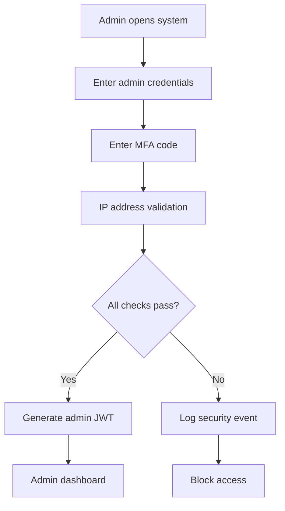

# 👨‍💼 Admin User Flow Documentation

## 🎯 Admin Role Overview

**Primary Users**: System administrators and healthcare facility managers  
**Main Goals**: 
- Manage doctor accounts and permissions
- Oversee patient registration and data integrity
- Monitor system-wide audit logs and security
- Maintain clinic and organizational structure
- Ensure GDPR compliance and data protection

## 🔐 Admin Authentication

### Enhanced Security for Admin Access


### Admin Authentication Requirements
- **Username**: Admin ID with organizational prefix
- **Password**: Minimum 16 characters with complexity
- **MFA**: Hardware token or authenticator app required
- **IP Restriction**: Only from authorized admin networks
- **Session**: 2-hour timeout with activity monitoring
- **Audit**: All login attempts logged and monitored

## 🏠 Admin Dashboard

### Dashboard Overview
```
🏥 Healthcare System Administration

┌─────────────────────────────────────────┐
│ 📊 System Statistics                    │
│ • Doctors: 45 active, 3 pending        │
│ • Patients: 12,340 registered          │
│ • Today's Activity: 234 visits         │
│ • Security Alerts: 0 critical          │
└─────────────────────────────────────────┘

┌─────────────┐ ┌─────────────┐ ┌─────────────┐
│ 👨‍⚕️ Doctor   │ │ 🧑 Patient  │ │ 🔍 Audit   │
│ Management  │ │ Management  │ │ Logs       │
└─────────────┘ └─────────────┘ └─────────────┘

┌─────────────┐ ┌─────────────┐ ┌─────────────┐
│ 🏥 Clinic   │ │ ⚙️ System   │ │ 📊 Reports │
│ Management  │ │ Settings    │ │ & Analytics│
└─────────────┘ └─────────────┘ └─────────────┘
```

## 👨‍⚕️ Doctor Management

### Doctor Account Creation Flow
```mermaid
graph TD
    A[Admin clicks 'Add Doctor'] --> B[Enter doctor details]
    B --> C[Verify medical license]
    C --> D[Assign to clinic(s)]
    D --> E[Set permissions]
    E --> F[Generate credentials]
    F --> G[Send welcome email]
    G --> H[Doctor added to system]
```

### Doctor Registration Form
```json
{
  "personalInfo": {
    "firstName": "Maria",
    "lastName": "Popescu",
    "email": "maria.popescu@clinic.md",
    "phone": "+373XXXXXXXX",
    "dateOfBirth": "1985-03-15"
  },
  "professionalInfo": {
    "medicalLicenseNumber": "MD12345",
    "specialization": "General Practice",
    "yearsOfExperience": 8,
    "educationLevel": "MD",
    "certifications": ["Family Medicine Board Certified"]
  },
  "systemAccess": {
    "username": "dr.popescu",
    "role": "Doctor",
    "assignedClinics": ["clinic_001", "clinic_002"],
    "permissions": [
      "READ_PATIENT_RECORDS",
      "WRITE_VISIT_RECORDS",
      "UPDATE_VACCINATIONS",
      "MANAGE_ALLERGIES"
    ],
    "accessLevel": "STANDARD"
  }
}
```

### Doctor Management Actions
1. **Create Doctor Account**
   - Enter personal and professional information
   - Verify medical license with national registry
   - Assign to clinic(s) and set permissions
   - Generate secure credentials

2. **Update Doctor Information**
   - Modify contact details
   - Update clinic assignments
   - Change access permissions
   - Suspend or reactivate accounts

3. **Password Management**
   - Reset doctor passwords
   - Force password updates
   - Configure MFA requirements
   - Manage security settings

4. **Activity Monitoring**
   - View doctor login history
   - Monitor patient access patterns
   - Track system usage statistics
   - Identify unusual activity

### Doctor List Interface
```
👨‍⚕️ Doctor Management

Search: [_________________] 🔍  Filter: [Active ▼]  Add Doctor [+]

┌─────────────────────────────────────────────────────────────────┐
│ Dr. Maria Popescu    │ General Practice │ City Clinic      │ ● │
│ maria.popescu@...    │ License: MD12345 │ Last: 2h ago     │ ⚙️ │
├─────────────────────────────────────────────────────────────────┤
│ Dr. Ion Smith        │ Cardiology      │ Central Hospital │ ● │
│ ion.smith@...        │ License: MD67890 │ Last: 30min ago  │ ⚙️ │
├─────────────────────────────────────────────────────────────────┤
│ Dr. Ana Ionescu      │ Pediatrics      │ Children's Clinic│ ○ │
│ ana.ionescu@...      │ License: MD11111 │ Suspended        │ ⚙️ │
└─────────────────────────────────────────────────────────────────┘

Legend: ● Active  ○ Suspended  ⚙️ Manage
```

## 🧑 Patient Management

### Patient Oversight Functions
While patients primarily self-register, admins can:

1. **Pre-register Patients**
   - Create patient accounts for new patients
   - Import patient data from legacy systems
   - Bulk registration for clinic transfers

2. **Patient Account Management**
   - Reset patient passwords
   - Update contact information
   - Resolve login issues
   - Merge duplicate accounts

3. **Data Integrity**
   - Validate IDNP uniqueness
   - Correct data entry errors
   - Resolve conflicting records
   - Maintain data quality standards

### Patient Search and Management
```
🧑 Patient Management

Search: [IDNP or Name_____] 🔍  Filter: [All ▼]  Actions: [Bulk ▼]

┌─────────────────────────────────────────────────────────────────┐
│ John Doe             │ 1234567890123   │ City Clinic      │ ● │
│ john.doe@email.com   │ DOB: 1990-01-15 │ Last: Today      │ 👁️ │
├─────────────────────────────────────────────────────────────────┤
│ Jane Smith           │ 1234567890124   │ Central Hospital │ ● │
│ jane.smith@email.com │ DOB: 1985-05-20 │ Last: Yesterday  │ 👁️ │
└─────────────────────────────────────────────────────────────────┘

Actions per patient:
• 👁️ View patient record (read-only)
• 🔒 Reset password
• ✏️ Update contact info
• 🔄 Merge accounts
• ⚠️ Flag for review
```

## 🔍 System-Wide Audit Logs

### Comprehensive Audit Dashboard
```
🔍 System Audit Dashboard

📅 Date Range: [Last 7 days ▼]  Filter: [All Actions ▼]  Export: [CSV] [PDF]

📊 Quick Stats:
• Total Actions: 2,847
• Doctor Logins: 245
• Patient Access: 1,892
• Admin Actions: 67
• Security Events: 3

⚠️ Security Alerts:
┌─────────────────────────────────────────────────────────────────┐
│ 🚨 Multiple failed login attempts                               │
│ User: dr.smith | IP: 192.168.1.50 | Time: 14:30               │
│ Action: Temporarily locked account                             │
└─────────────────────────────────────────────────────────────────┘

📋 Recent Activity:
┌─────────────────────────────────────────────────────────────────┐
│ 🕐 14:45 | Dr. Popescu | PATIENT_RECORD_ACCESS                 │
│ Patient: John Doe (1234567890123) | Duration: 15 min          │
├─────────────────────────────────────────────────────────────────┤
│ 🕐 14:30 | Admin User | DOCTOR_ACCOUNT_CREATED                 │
│ New Doctor: Dr. Ana Ionescu | Clinic: Children's Clinic       │
├─────────────────────────────────────────────────────────────────┤
│ 🕐 14:15 | Patient Jane | PROFILE_UPDATE                      │
│ Updated: Contact information | IP: 192.168.1.200             │
└─────────────────────────────────────────────────────────────────┘
```

### Audit Log Categories
1. **Authentication Events**
   - Login attempts (successful/failed)
   - Password changes
   - MFA events
   - Session timeouts

2. **Data Access Events**
   - Patient record access
   - Medical record modifications
   - Document uploads/downloads
   - Data exports

3. **Administrative Actions**
   - User account management
   - Permission changes
   - System configuration updates
   - Data corrections

4. **Security Events**
   - Failed login attempts
   - Unauthorized access attempts
   - Suspicious activity patterns
   - Data breach incidents

### Advanced Audit Features
```json
{
  "auditQuery": {
    "dateRange": {
      "start": "2025-09-01T00:00:00Z",
      "end": "2025-09-04T23:59:59Z"
    },
    "filters": {
      "userType": ["Doctor", "Patient"],
      "actionType": ["PATIENT_RECORD_ACCESS"],
      "severity": ["HIGH", "CRITICAL"],
      "clinic": ["clinic_001"]
    },
    "searchTerms": "patient_id:12345 OR doctor_id:dr_001"
  }
}
```

## 🏥 Clinic Management

### Clinic Structure Administration
```
🏥 Clinic Management

┌─────────────────────────────────────────────────────────────────┐
│ City Clinic                           │ Active │ 15 Doctors    │
│ Address: 123 Main St, Chisinau        │        │ 2,340 Patients│
│ Phone: +373-22-123456                 │        │ Edit │ View   │
├─────────────────────────────────────────────────────────────────┤
│ Central Hospital                      │ Active │ 25 Doctors    │
│ Address: 456 Central Ave, Chisinau    │        │ 5,680 Patients│
│ Phone: +373-22-789012                 │        │ Edit │ View   │
├─────────────────────────────────────────────────────────────────┤
│ Children's Clinic                     │ Active │ 8 Doctors     │
│ Address: 789 Kids St, Chisinau        │        │ 1,250 Patients│
│ Phone: +373-22-345678                 │        │ Edit │ View   │
└─────────────────────────────────────────────────────────────────┘
```

### Clinic Management Features
1. **Clinic Registration**
   - Add new medical facilities
   - Set clinic details and contact info
   - Configure operating hours
   - Assign clinic administrators

2. **Doctor Assignment**
   - Assign doctors to clinics
   - Manage multi-clinic assignments
   - Set clinic-specific permissions
   - Transfer doctors between clinics

3. **Patient Assignment**
   - Assign patients to primary clinics
   - Manage cross-clinic referrals
   - Set access permissions per clinic

4. **Clinic Analytics**
   - Patient visit statistics
   - Doctor utilization rates
   - Popular services and treatments
   - Clinic performance metrics

## ⚙️ System Settings & Configuration

### Global System Configuration
```
⚙️ System Settings

Security Settings:
├── Password Policy Configuration
├── MFA Requirements
├── Session Timeout Settings
├── IP Access Controls
├── Audit Log Retention
└── Data Encryption Settings

Data Management:
├── Backup Schedule Configuration
├── Data Retention Policies
├── GDPR Compliance Settings
├── Data Export Formats
├── Integration Settings
└── API Rate Limiting

Notification Settings:
├── Email Server Configuration
├── SMS Provider Settings
├── Alert Thresholds
├── Notification Templates
└── Emergency Contact Protocols
```

### GDPR Compliance Management
```json
{
  "gdprSettings": {
    "dataRetention": {
      "patientRecords": "10 years",
      "auditLogs": "7 years",
      "backups": "2 years"
    },
    "dataProcessing": {
      "consentRequired": true,
      "purposeLimitation": true,
      "dataMinimization": true,
      "accuracyMaintenance": true
    },
    "patientRights": {
      "dataAccess": true,
      "dataPortability": true,
      "dataCorrection": true,
      "dataDeletion": true,
      "processingRestriction": true
    }
  }
}
```

## 📊 Reports & Analytics

### Administrative Reports
1. **User Activity Reports**
   - Doctor login frequency
   - Patient engagement metrics
   - Peak usage times
   - System performance stats

2. **Security Reports**
   - Failed login attempts
   - Suspicious activity patterns
   - Data access anomalies
   - Compliance violations

3. **Data Quality Reports**
   - Incomplete patient records
   - Duplicate entries
   - Data validation errors
   - Missing critical information

4. **Operational Reports**
   - System uptime statistics
   - Response time metrics
   - Error rates and types
   - Capacity planning data

### Report Generation Interface
```
📊 Reports & Analytics

Report Type: [Security Report ▼]
Date Range: [Last 30 days ▼]
Format: [PDF ▼] [Excel ▼]
Recipients: [admin@clinic.md_______] [+ Add]

┌─────────────────────────────────────────┐
│ 📈 Quick Stats (Last 30 days)          │
│ • Total Logins: 3,247                  │
│ • Failed Attempts: 23                  │
│ • New Patients: 156                    │
│ • Active Doctors: 45                   │
│ • Data Exports: 12                     │
│ • Security Incidents: 1               │
└─────────────────────────────────────────┘

[Generate Report] [Schedule Recurring] [View History]
```

## 🚨 Emergency & Incident Management

### Security Incident Response
1. **Incident Detection**
   - Automated alerts for suspicious activity
   - Manual incident reporting
   - Integration with security monitoring tools

2. **Incident Response**
   - Immediate account lockdown
   - Evidence preservation
   - Stakeholder notification
   - Forensic analysis initiation

3. **Recovery Procedures**
   - System restoration protocols
   - Data integrity verification
   - Service resumption plans
   - Post-incident review

### Emergency Access Management
```
🚨 Emergency Access Override

Emergency Situation: [Medical Emergency ▼]
Requesting Doctor: [Dr. Emergency Room___]
Patient IDNP: [1234567890123_______]
Justification: [Patient unconscious, needs immediate medical history access]

Override Duration: [2 hours ▼]
Supervisor Approval: [Dr. Chief Medical Officer]

[Grant Emergency Access] [Log Incident] [Notify Patient]

⚠️ All emergency access is automatically logged and audited
```

---

*This comprehensive admin documentation ensures that system administrators have complete control over the Secure Health Record System while maintaining the highest standards of security, compliance, and operational efficiency.*
