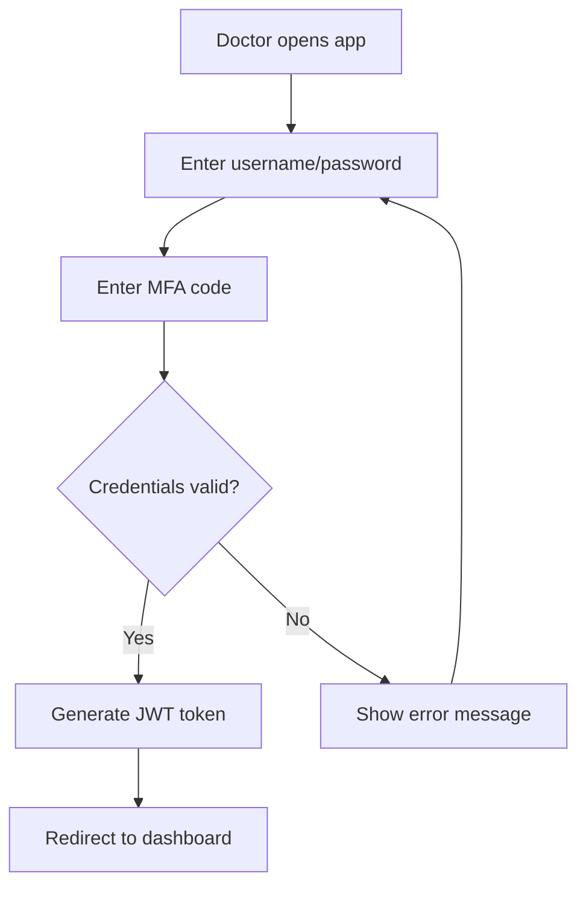
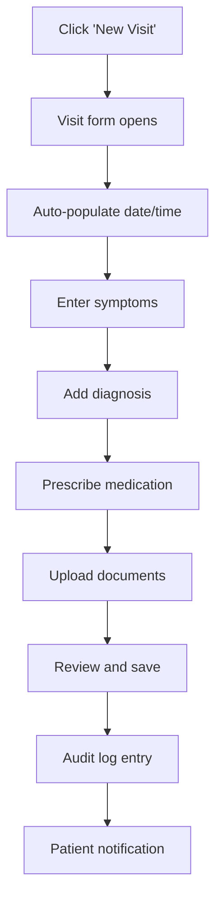

# 👩‍⚕️ Doctor User Flow Documentation

## 🎯 Doctor Role Overview

**Primary Users**: Licensed medical professionals  
**Main Goals**: 
- Efficiently access and update patient records
- Maintain accurate medical history
- Ensure patient care continuity
- Comply with medical record-keeping standards

## 🔐 Authentication Flow

### Login Process


### Authentication Requirements
- **Username**: Medical license number or assigned ID
- **Password**: Minimum 12 characters, special characters required
- **MFA**: Time-based OTP (TOTP) via authenticator app
- **Session**: 8-hour timeout with auto-logout

## 🏠 Dashboard Interface

### Main Dashboard Components
1. **Search Patient Section**
   - IDNP search field (primary)
   - Name search (secondary)
   - Recent patients list

2. **Quick Actions**
   - Add new visit record
   - View pending tasks
   - Access clinic schedule

3. **Statistics Widget**
   - Patients seen today
   - Pending records to review
   - System notifications

## 🔍 Patient Search & Access

### Search Flow
```
1. Doctor enters IDNP in search field
2. System validates IDNP format (13 digits)
3. Database query for patient record
4. Security check: Doctor has access to patient
5. Audit log entry created
6. Patient record displayed
```

### Search Methods
- **Primary**: IDNP (Personal Identification Number)
- **Secondary**: Full name + date of birth
- **Filters**: Age range, last visit date, assigned clinic

### Search Results
```json
{
  "patientId": "12345",
  "fullName": "John Doe",
  "idnp": "1234567890123",
  "dateOfBirth": "1990-01-15",
  "lastVisit": "2025-08-30",
  "bloodType": "A+",
  "criticalAllergies": ["Penicillin"],
  "accessLevel": "full"
}
```

## 📋 Patient Record Interface

### Record Tabs Structure
1. **Profile Tab** - Basic demographics and health info
2. **Visits Tab** - Chronological visit history
3. **Vaccines Tab** - Vaccination record
4. **Allergies Tab** - Known allergies and reactions
5. **Documents Tab** - Uploaded medical files

### Profile Tab Details
```
👤 Basic Information
├── Full Name
├── IDNP
├── Date of Birth
├── Gender
├── Contact Information
├── Emergency Contact
└── Assigned Clinic

🩸 Health Information
├── Blood Type
├── Height/Weight (latest)
├── Chronic Conditions
├── Current Medications
└── Insurance Information
```

## 📝 Adding Visit Records

### Visit Creation Flow


### Visit Record Form Fields

#### Required Fields
- **Date/Time**: Auto-generated, editable
- **Chief Complaint**: Patient's main concern
- **Diagnosis**: ICD-10 coded diagnosis
- **Treatment Plan**: Prescribed treatment

#### Optional Fields
- **Symptoms**: Detailed symptom description
- **Vital Signs**: Blood pressure, temperature, etc.
- **Medications**: Prescribed drugs with dosage
- **Follow-up**: Next appointment recommendation
- **Documents**: Attach lab results, images, etc.

### Example Visit Record
```json
{
  "visitId": "visit_001",
  "patientId": "12345",
  "doctorId": "dr_001",
  "dateTime": "2025-09-04T14:30:00Z",
  "chiefComplaint": "Persistent cough for 2 weeks",
  "symptoms": [
    "Dry cough",
    "Mild fever",
    "Fatigue"
  ],
  "vitalSigns": {
    "temperature": "38.2°C",
    "bloodPressure": "120/80",
    "pulse": "72 bpm"
  },
  "diagnosis": {
    "icd10": "J20.9",
    "description": "Acute bronchitis, unspecified"
  },
  "treatment": "Rest, increased fluid intake, bronchodilator as needed",
  "medications": [
    {
      "name": "Salbutamol inhaler",
      "dosage": "2 puffs every 4-6 hours as needed",
      "duration": "7 days"
    }
  ],
  "followUp": "Return in 1 week if symptoms persist",
  "attachments": ["chest_xray_001.jpg"]
}
```

## 💉 Vaccination Management

### Adding Vaccination Record
1. Navigate to Vaccines tab
2. Click "Add Vaccination"
3. Select vaccine type from dropdown
4. Enter administration date
5. Add batch number and manufacturer
6. Note any adverse reactions
7. Save record

### Vaccine Record Fields
```json
{
  "vaccineId": "vacc_001",
  "vaccineType": "COVID-19 mRNA",
  "manufacturer": "Pfizer-BioNTech",
  "batchNumber": "ABC123",
  "administrationDate": "2025-09-04",
  "administeredBy": "dr_001",
  "site": "Left deltoid",
  "adverseReactions": "None reported",
  "nextDue": "2026-09-04"
}
```

## 🚨 Allergy Management

### Managing Patient Allergies
1. Navigate to Allergies tab
2. View current allergies list
3. Add new allergy or update existing
4. Mark severity level (Mild/Moderate/Severe)
5. Set status (Active/Resolved/Suspected)

### Allergy Record Structure
```json
{
  "allergyId": "allergy_001",
  "allergen": "Penicillin",
  "allergyType": "Drug",
  "severity": "Severe",
  "reaction": "Anaphylaxis",
  "onsetDate": "2020-03-15",
  "status": "Active",
  "notes": "Patient carries EpiPen"
}
```

## 📄 Document Management

### File Upload Process
1. Click "Upload Document" in Documents tab
2. Select file (PDF, JPG, PNG, DICOM)
3. Add document type and description
4. Upload and associate with visit (optional)
5. Document appears in patient record

### Supported File Types
- **Images**: JPG, PNG, TIFF
- **Documents**: PDF, DOC, DOCX
- **Medical**: DICOM, HL7
- **Lab Results**: PDF, XML

## 🔍 Audit Trail Visibility

### What Doctors Can See
- **Own Actions**: All their access and modifications
- **Patient Access**: Who else accessed the patient
- **Recent Changes**: What was modified and when
- **Data Source**: Who entered specific information

### Audit Log Entry Example
```json
{
  "timestamp": "2025-09-04T14:30:00Z",
  "doctorId": "dr_001",
  "doctorName": "Dr. Maria Popescu",
  "action": "VIEW_PATIENT_RECORD",
  "patientId": "12345",
  "details": "Accessed full patient record",
  "ipAddress": "192.168.1.100",
  "location": "Clinic A - Room 203"
}
```

## 🔒 Security & Privacy Features

### Access Controls
- **Need-to-Know Basis**: Only assigned patients visible
- **Clinic Restrictions**: Can only see patients from assigned clinics
- **Time-Limited Access**: Sessions expire after inactivity
- **IP Restrictions**: Access only from clinic networks

### Privacy Protections
- **Minimum Data Display**: Only essential info shown initially
- **Explicit Consent**: Patient consent required for sensitive data
- **Data Masking**: Partial masking of sensitive information
- **Audit Transparency**: All access logged and visible to patient

## 📱 Mobile Considerations (Future)

### Mobile App Features
- **Quick Patient Lookup**: Simplified search interface
- **Voice Notes**: Speech-to-text for visit notes
- **Camera Integration**: Capture and upload images
- **Offline Mode**: Basic record viewing when offline

---

*This documentation covers the complete doctor user flow for the Secure Health Record System. It will be updated as features are implemented and refined based on user feedback.*
