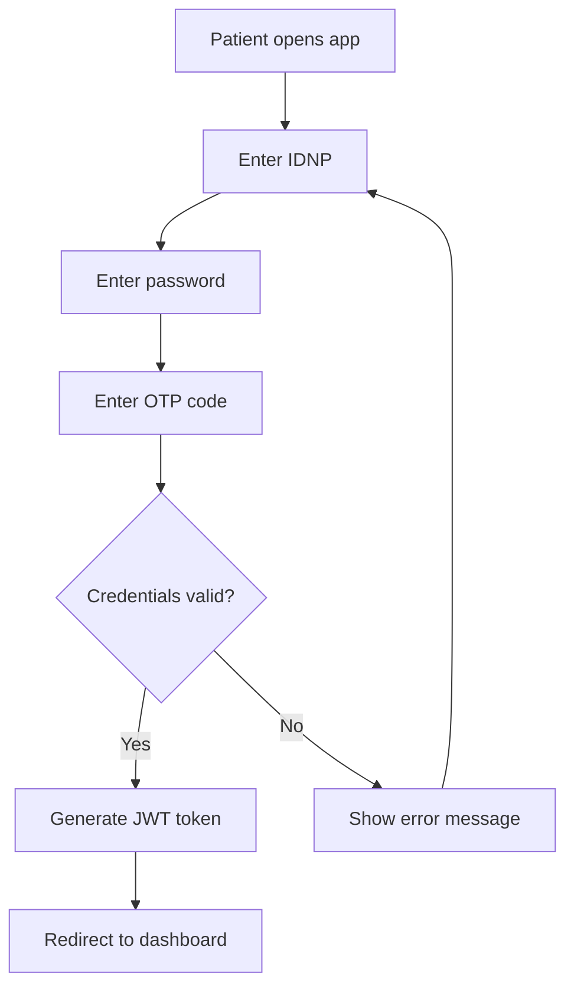

# 🧑 Patient User Flow Documentation

## 🎯 Patient Role Overview

**Primary Users**: Healthcare system patients  
**Main Goals**: 
- Access personal medical records
- Monitor health history and vaccinations
- Track doctor visits and prescriptions
- Maintain transparency of medical data access

## 🔐 Authentication Flow

### Login Process


### Authentication Requirements
- **IDNP**: 13-digit Personal Identification Number
- **Password**: Minimum 8 characters with complexity requirements
- **OTP**: SMS or app-based one-time password (optional for MVP)
- **Session**: 4-hour timeout with auto-logout

## 🏠 Patient Dashboard

### Dashboard Components
1. **Health Summary Card**
   - Name and basic info
   - Blood type and critical allergies
   - Last doctor visit date
   - Upcoming appointments (future feature)

2. **Quick Access Buttons**
   - View Medical History
   - Check Vaccination Record
   - See Audit Log
   - Update Profile

3. **Recent Activity**
   - New visit records
   - Updated vaccinations
   - Doctor access notifications
   - System alerts

### Dashboard Layout Example
```
┌─────────────────────────────────────────┐
│  👤 John Doe (IDNP: 1234567890123)     │
│  🩸 Blood Type: A+                      │
│  ⚠️  Allergies: Penicillin             │
│  📅 Last Visit: Sept 1, 2025           │
└─────────────────────────────────────────┘

┌─────────────┐ ┌─────────────┐ ┌─────────────┐
│ 📋 Medical  │ │ 💉 Vaccines │ │ 🔍 Audit   │
│ History     │ │            │ │ Log        │
└─────────────┘ └─────────────┘ └─────────────┘

📢 Recent Activity:
• Dr. Popescu added a visit record (2 hours ago)
• Vaccination record updated (Yesterday)
• Dr. Smith accessed your record (Sept 1)
```

## 👤 Profile Management

### Viewable Profile Information
```json
{
  "personalInfo": {
    "fullName": "John Doe",
    "idnp": "1234567890123",
    "dateOfBirth": "1990-01-15",
    "gender": "Male",
    "bloodType": "A+",
    "contactInfo": {
      "phone": "+373XXXXXXXX",
      "email": "john.doe@email.com",
      "address": "Chisinau, Moldova"
    }
  },
  "healthInfo": {
    "height": "175 cm",
    "weight": "70 kg",
    "chronicConditions": ["Hypertension"],
    "emergencyContact": {
      "name": "Jane Doe",
      "relationship": "Spouse",
      "phone": "+373YYYYYYYY"
    }
  }
}
```

### Editable Fields
Patients can update:
- ✅ Contact information (phone, email, address)
- ✅ Emergency contact details
- ✅ Height and weight
- ❌ Name, IDNP, date of birth (admin only)
- ❌ Medical history (doctor only)

## 📋 Medical History View

### Visit Records Display
```
📅 Medical History

┌─────────────────────────────────────────┐
│ 📅 September 4, 2025                   │
│ 👨‍⚕️ Dr. Maria Popescu                 │
│ 🏥 City Clinic - Room 203              │
│                                         │
│ Chief Complaint: Persistent cough       │
│ Diagnosis: Acute bronchitis             │
│ Treatment: Rest, bronchodilator         │
│ Medications: Salbutamol inhaler         │
│                                         │
│ 📎 Attachments: chest_xray_001.jpg     │
└─────────────────────────────────────────┘

┌─────────────────────────────────────────┐
│ 📅 August 30, 2025                     │
│ 👨‍⚕️ Dr. Ion Smith                     │
│ 🏥 Central Hospital                     │
│                                         │
│ Chief Complaint: Annual checkup         │
│ Diagnosis: Healthy                      │
│ Treatment: Continue current lifestyle   │
│ Medications: None                       │
└─────────────────────────────────────────┘
```

### Visit Record Details
Each visit record shows:
- **Date and Time**: When the visit occurred
- **Doctor Information**: Name and credentials
- **Clinic/Hospital**: Location of visit
- **Chief Complaint**: Why the patient visited
- **Diagnosis**: Medical diagnosis (ICD-10 codes translated)
- **Treatment Plan**: Prescribed treatment
- **Medications**: Prescribed drugs with dosages
- **Follow-up**: Next appointment recommendations
- **Documents**: Downloadable attachments

## 💉 Vaccination History

### Vaccination Record View
```
💉 Vaccination History

┌─────────────────────────────────────────┐
│ COVID-19 mRNA Vaccine (Pfizer)          │
│ 📅 Date: September 4, 2025             │
│ 👨‍⚕️ Administered by: Dr. Popescu     │
│ 📍 Location: City Clinic               │
│ 🆔 Batch: ABC123                       │
│ ➡️ Next Due: September 4, 2026         │
└─────────────────────────────────────────┘

┌─────────────────────────────────────────┐
│ Influenza Vaccine                       │
│ 📅 Date: October 15, 2024              │
│ 👨‍⚕️ Administered by: Dr. Smith       │
│ 📍 Location: Central Hospital          │
│ 🆔 Batch: FLU2024                      │
│ ➡️ Next Due: October 15, 2025          │
└─────────────────────────────────────────┘
```

### Vaccination Certificate
Patients can:
- **View** complete vaccination history
- **Download** vaccination certificates (PDF)
- **Share** certificates with authorities
- **Get Reminders** for upcoming vaccinations (future)

## 🚨 Allergies & Medical Alerts

### Allergy Information Display
```
⚠️ Medical Alerts

🚨 SEVERE ALLERGIES:
┌─────────────────────────────────────────┐
│ 💊 Penicillin - SEVERE                 │
│ Reaction: Anaphylaxis                   │
│ First Reaction: March 15, 2020          │
│ Status: Active                          │
│ Notes: Patient carries EpiPen          │
└─────────────────────────────────────────┘

⚠️ MODERATE ALLERGIES:
┌─────────────────────────────────────────┐
│ 🥜 Peanuts - MODERATE                  │
│ Reaction: Hives, swelling               │
│ First Reaction: June 10, 2018           │
│ Status: Active                          │
└─────────────────────────────────────────┘
```

### Medical Alert Features
- **Critical Alerts**: Prominently displayed allergies
- **Severity Levels**: Clear indication of reaction severity
- **Emergency Info**: Quick access for emergency responders
- **Status Tracking**: Active vs. resolved allergies

## 🔍 Audit Log Transparency

### Access History View
```
🔍 Who Accessed My Record

📅 Today (September 4, 2025)
┌─────────────────────────────────────────┐
│ 🕐 14:30 - Dr. Maria Popescu           │
│ 📋 Action: Added visit record           │
│ 📍 Location: City Clinic, Room 203     │
│ 🌐 IP: 192.168.1.100                   │
└─────────────────────────────────────────┘

┌─────────────────────────────────────────┐
│ 🕐 09:15 - Dr. Maria Popescu           │
│ 📋 Action: Viewed patient record        │
│ 📍 Location: City Clinic, Room 203     │
│ 🌐 IP: 192.168.1.100                   │
└─────────────────────────────────────────┘

📅 Yesterday (September 3, 2025)
┌─────────────────────────────────────────┐
│ 🕐 16:45 - Nurse Ana Ionescu           │
│ 📋 Action: Updated vaccination record   │
│ 📍 Location: City Clinic               │
│ 🌐 IP: 192.168.1.105                   │
└─────────────────────────────────────────┘
```

### Audit Log Features
- **Real-time Updates**: Immediate notification of access
- **Detailed Information**: Who, what, when, where
- **Search & Filter**: Find specific access events
- **Export Options**: Download audit history (PDF)
- **Privacy Controls**: Request access restrictions

### Audit Entry Details
```json
{
  "timestamp": "2025-09-04T14:30:00Z",
  "accessedBy": {
    "name": "Dr. Maria Popescu",
    "id": "dr_001",
    "role": "Doctor",
    "clinic": "City Clinic"
  },
  "action": "ADD_VISIT_RECORD",
  "details": "Added new visit record with diagnosis",
  "location": {
    "clinic": "City Clinic",
    "room": "203",
    "ipAddress": "192.168.1.100"
  },
  "dataAccessed": [
    "Medical History",
    "Current Medications",
    "Allergy Information"
  ]
}
```

## 📱 Mobile-First Design

### Mobile Interface Priorities
1. **Quick Health Summary**: Essential info at a glance
2. **Emergency Access**: Critical allergies and contacts
3. **Recent Activity**: Latest visit and doctor access
4. **Simple Navigation**: Easy access to all sections

### Mobile User Flow
```
Launch App → Quick Auth → Dashboard
    ↓
Health Summary (Blood type, allergies)
    ↓
Quick Actions:
├── Medical History
├── Vaccinations
├── Audit Log
└── Emergency Info
```

## 🔒 Privacy & Security Features

### Patient Privacy Controls
- **Access Requests**: Approve/deny doctor access requests
- **Data Sharing**: Control what information is shared
- **Consent Management**: Granular consent for data use
- **Data Export**: Download complete medical record
- **Account Deletion**: Request account and data deletion

### Security Features for Patients
- **Login Notifications**: Alert for each login attempt
- **Device Management**: View and revoke device access
- **Suspicious Activity**: Alerts for unusual access patterns
- **Secure Communications**: Encrypted messaging with doctors

## 📧 Notifications & Alerts

### Notification Types
1. **New Visit Record**: Doctor added a visit
2. **Record Access**: Someone viewed your records
3. **Vaccination Due**: Upcoming vaccination reminder
4. **Document Added**: New test results or certificates
5. **Security Alert**: Suspicious login attempt

### Notification Preferences
```json
{
  "emailNotifications": {
    "newVisitRecord": true,
    "recordAccess": true,
    "vaccinationReminders": true,
    "securityAlerts": true
  },
  "smsNotifications": {
    "securityAlerts": true,
    "emergencyUpdates": true
  },
  "pushNotifications": {
    "newRecords": true,
    "recordAccess": false,
    "reminders": true
  }
}
```

## 🆘 Emergency Features

### Emergency Information Access
- **Medical ID Card**: Quick access to critical info
- **Emergency Contacts**: Readily available contact list
- **Critical Allergies**: Prominent allergy warnings
- **Current Medications**: List of active medications
- **Medical Conditions**: Chronic conditions and implants

### Emergency Access Without Login
```
Emergency Access Portal
├── Medical ID by IDNP
├── Critical Allergies Only
├── Emergency Contacts
└── Blood Type & Medical Alerts
```

---

*This documentation provides a comprehensive view of the patient user experience in the Secure Health Record System. The interface prioritizes transparency, ease of use, and patient empowerment while maintaining the highest security standards.*
